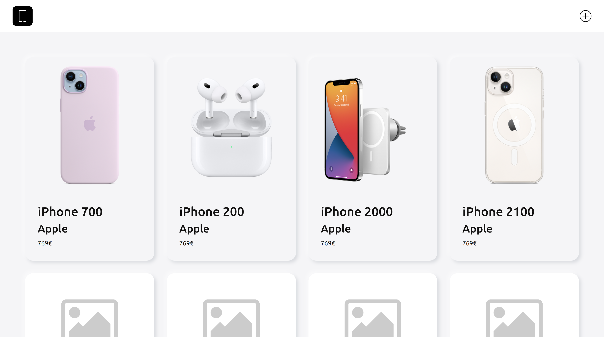
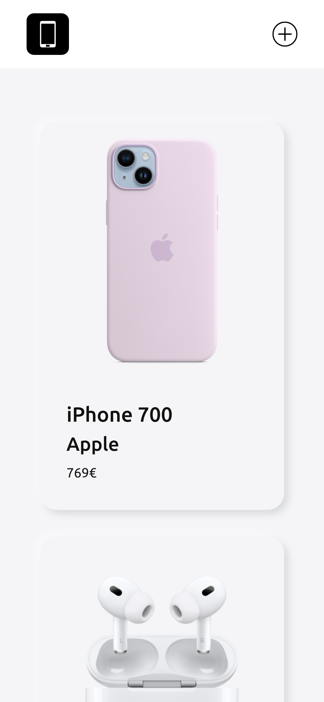
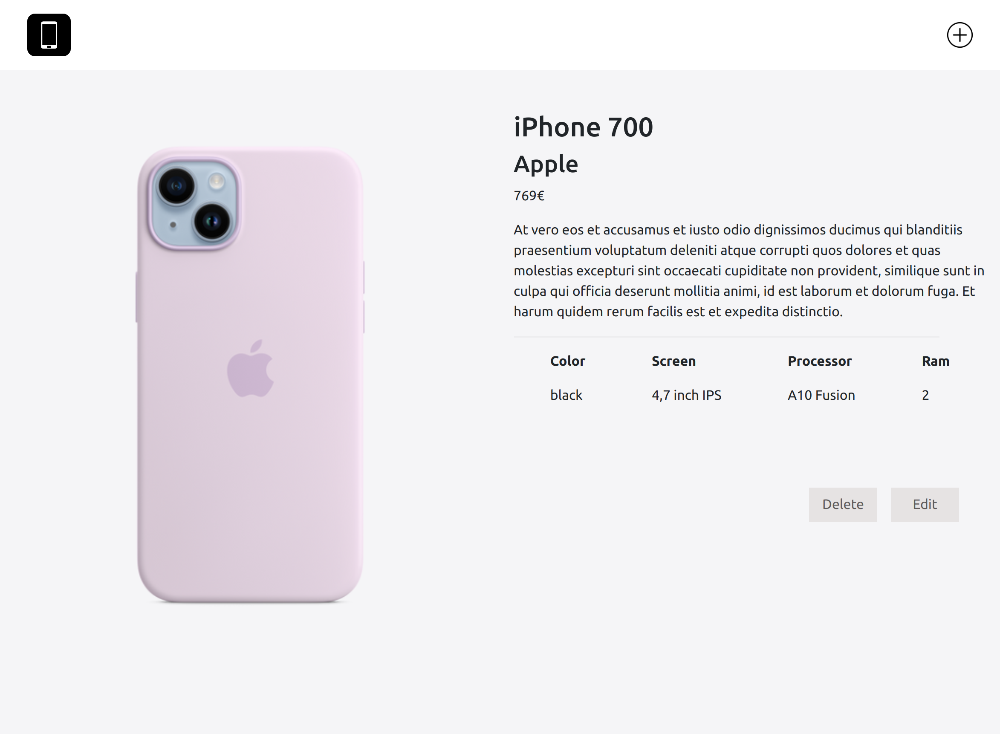
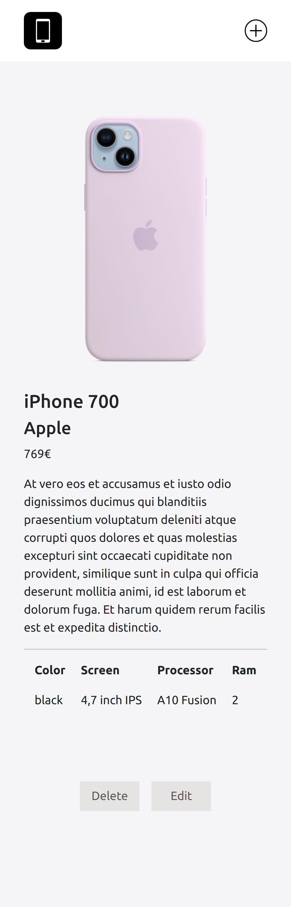

## PHONE CATALOGUE APP

### INTRODUCTION

The functionality of this application is to display a list of phones and see theirs details.

This project has been developed with REACT.

### FUNCTIONAL DESCRIPTION

Users can:

· Retrieve the phone catalogue.

· Consult all phones details.

### TECHNOLOGIES

Javascript, ReactJS, HTML, CSS

### SETUP

[To use the api](https://github.com/clopezca/phones-app)

### How to install

> git clone git@github.com:clopezca/phones-app.git

> cd phones-app

> npm i

### How to use

To up server from the terminal

> npm run start

> Vist localhost:3000 

### TODO

- Add test
- Add form validation
- Edit phone
- Delete phone
- Create search functionality